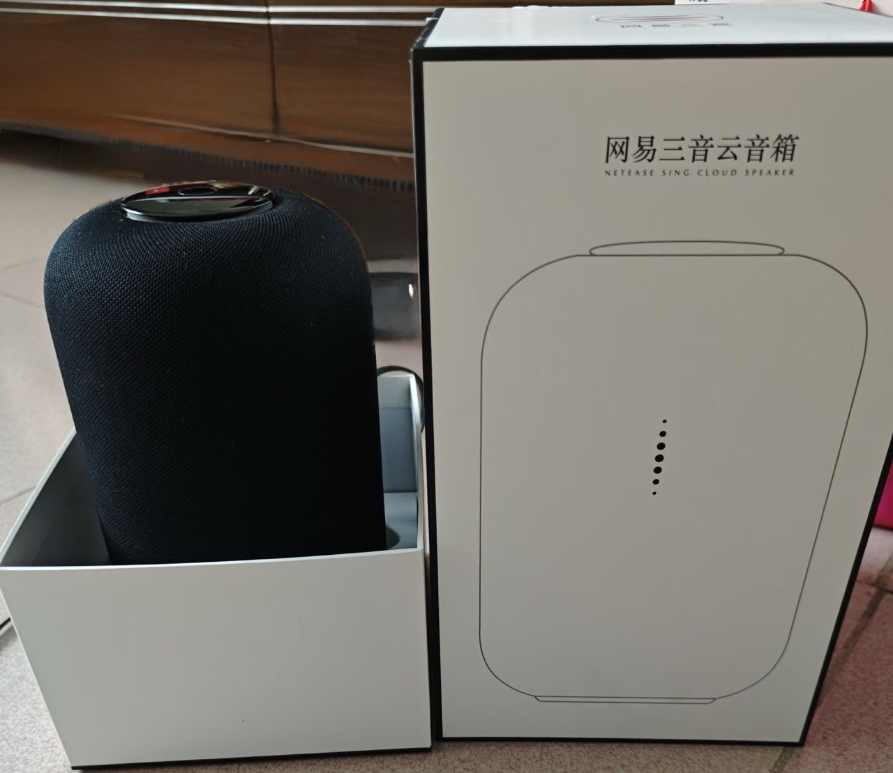
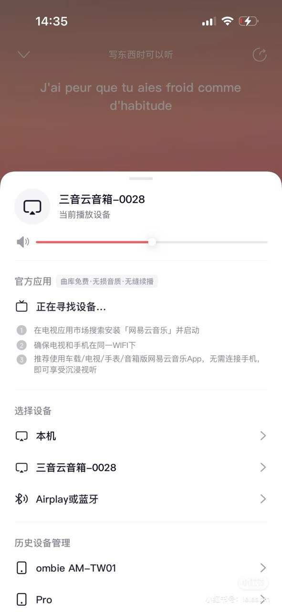

# Netease Sing Cloud Speaker Rescue

> A public collaboration hub for reviving the abandoned **Netease Sing Cloud Speaker** (`网易三音云音箱`).

<p align="center">
  
  
</p>

## Quick links

- `Project brief:` `PROJECT_BRIEF.md`
- `Product dossier:` `docs/product_dossier.md`
- `Help channels:` `docs/help_channels.md`
- `Posting plan:` `docs/posting_plan.md`
- `Social posts:` `docs/social_posts.md`
- `Contributing:` `CONTRIBUTING.md`
- `Artifacts:` `artifacts/README.md`

## Status

- **Project type:** documentation + community help request
- **Current goal:** collect evidence, attract experts, organize reverse-engineering work
- **Not yet:** a finished unlock, firmware, or replacement app

## Why this project exists

This speaker appears to have lost practical usability after the original ecosystem was abandoned:

- newer app flows no longer provide a clear setup / recovery entry
- reconnecting the speaker to Wi‑Fi is difficult or impossible
- there is no 3.5mm audio input
- it does not behave like a normal Bluetooth speaker in its current state
- the hardware still looks too good to become e-waste

This repository is meant to give hardware hackers, reverse engineers, BLE specialists, embedded Linux developers, and Home Assistant builders a single place to start.

## What we know so far

Public reports and teardowns suggest the device may include:

- `Allwinner R16-J`
- `AP6236`
- `Broadcom BCM43436`
- `TI TPA3118`
- `ADAU1761`
- `STM32F105`
- `Mini-USB`
- `Reset` button
- reserved `TF` card slot footprint

This makes the speaker potentially much more interesting than a fully closed microcontroller-only device.

## What kind of help is needed

We are looking for people experienced with:

- BLE / Bluetooth reverse engineering
- Android / embedded Linux analysis
- UART / debug port identification
- firmware extraction and inspection
- local network protocol discovery
- speaker repurposing for Home Assistant or AI voice endpoints

## Possible technical paths

1. **Recover provisioning**  
   Reverse the BLE / Wi‑Fi onboarding flow and reconnect the device.

2. **Find local LAN APIs**  
   Discover HTTP / TCP / mDNS / SSDP services and control playback locally.

3. **Access the original system**  
   Use `Mini-USB`, UART, test pads, or storage interfaces to inspect firmware.

4. **Repurpose the hardware**  
   Keep the speaker, amp, and mic array, but replace or bypass the original control path.

## Repository contents

- `CONTRIBUTING.md` — how contributors can help
- `PROJECT_BRIEF.md` — project positioning and collaboration overview
- `docs/product_dossier.md` — collected product and hardware notes
- `docs/help_channels.md` — communities and forums to ask for help
- `docs/posting_plan.md` — where to post and in what order
- `docs/social_posts.md` — ready-to-post X / forum copy
- `docs/forum_post_en.md` — English post template
- `docs/forum_post_zh.md` — Chinese post template
- `docs/public_sources.md` — public references used so far
- `docs/research_checklist.md` — evidence collection checklist
- `artifacts/README.md` — where to upload collected evidence
- `scripts/device_probe.py` — optional BLE / LAN probe helper

## Evidence that would help the most

If you want to help or guide the next step, these are the most useful missing pieces:

- bottom label photo
- exact model / serial / regulatory labels
- router DHCP hostname / MAC prefix / vendor info
- Bluetooth scan results from Windows or Android
- what happens when `Mini-USB` is connected to a computer
- teardown photos of both sides of the mainboard
- power-on voice prompts or recordings

## Probe helper

There is an optional script for collecting BLE and LAN evidence.

Install dependencies:

```bash
pip install -r requirements.txt
```

BLE scan:

```bash
python scripts/device_probe.py --ble-name Netease --scan-ble --timeout 15
```

LAN scan:

```bash
python scripts/device_probe.py --scan-lan --subnet 192.168.1.0/24
```

Known IP:

```bash
python scripts/device_probe.py --ip 192.168.1.88
```

Results are written to:

```text
artifacts/probe_result.json
```

## Public references

Current notes are based on public material such as:

- teardown reports
- media reviews
- launch / crowdfunding reports
- historical app download pages

See `docs/public_sources.md` for the current reference list.

## Disclaimer

Please only investigate hardware you legally own. Do not attack third-party systems or networks, and do not bypass systems you are not authorized to access.

---

# 网易三音云音箱求助协作项目

> 一个面向公开协作的求助项目，用来整理资料、收集证据、吸引高手接手逆向与复活工作。

<p align="center">
  
  
</p>

## 快速入口

- `项目简介：` `PROJECT_BRIEF.md`
- `产品档案：` `docs/product_dossier.md`
- `求助渠道：` `docs/help_channels.md`
- `发帖方案：` `docs/posting_plan.md`
- `社交短帖：` `docs/social_posts.md`
- `参与方式：` `CONTRIBUTING.md`
- `证据目录：` `artifacts/README.md`

## 当前状态

- **项目性质：** 资料整理 + 公开求助 + 后续证据沉淀
- **当前目标：** 把产品信息尽量收全，把高手能接手的入口搭好
- **目前不是：** 已经完成的破解、刷机包、替代 App

## 为什么要做这个项目

这台音箱现在的核心问题不是“坏了”，而是**厂商生态衰退后功能基本失效**：

- 新版流程里看不到明确的恢复配网入口
- 很难重新连接 Wi‑Fi
- 没有 `3.5mm` 音频输入
- 也不能直接当普通蓝牙音箱使用
- 但硬件本身看起来并不差，直接报废非常可惜

所以这个仓库的目标不是让普通用户自己单打独斗，而是让懂下面方向的人能快速看懂、快速判断、快速接手：

- 蓝牙 / BLE
- 嵌入式 Linux / Android
- 调试口 / UART / 固件提取
- 局域网协议分析
- Home Assistant / 智能体语音终端改造

## 目前已知信息

根据公开拆解与评测资料，这台设备可能包含：

- `Allwinner R16-J`
- `AP6236`
- `Broadcom BCM43436`
- `TI TPA3118`
- `ADAU1761`
- `STM32F105`
- `Mini-USB`
- `Reset` 按键
- 预留 `TF` 卡位

这意味着它并不是一个完全无从下手的黑盒设备，理论上仍然有研究和复活价值。

## 目前最需要哪类高手

欢迎以下方向的朋友参与：

- BLE / 蓝牙协议分析
- Android / Linux 固件研究
- 串口 / 调试口识别
- 局域网服务探测与控制接口分析
- 音箱硬改 / 主控替换 / 二次利用

## 可能的技术路线

1. **恢复原配网链路**  
   找回 BLE 配网或 Wi‑Fi 初始化流程，让设备重新联网。

2. **发现局域网本地接口**  
   如果设备还能在局域网中暴露 HTTP / TCP / mDNS / SSDP 服务，就有机会做本地控制。

3. **进入原系统继续深挖**  
   通过 `Mini-USB`、UART、测试点、存储芯片等方式进入系统或导出固件。

4. **保留优秀音频硬件，重做控制路径**  
   如果原厂软件完全不可救，可以只保留音腔、功放、麦克风，重新改造成：
   - 网络音箱
   - TTS 播放终端
   - Home Assistant 语音设备
   - 智能体语音输出终端

## 仓库内容

- `CONTRIBUTING.md` — 贡献说明与协作方式
- `PROJECT_BRIEF.md` — 项目定位与协作简介
- `docs/product_dossier.md` — 产品资料档案
- `docs/help_channels.md` — 求助渠道清单
- `docs/posting_plan.md` — 发帖顺序与执行建议
- `docs/social_posts.md` — X / 论坛短帖文案
- `docs/forum_post_en.md` — 英文发帖模板
- `docs/forum_post_zh.md` — 中文发帖模板
- `docs/public_sources.md` — 公开来源清单
- `docs/research_checklist.md` — 资料补充与排查清单
- `artifacts/README.md` — 后续证据上传位置说明
- `scripts/device_probe.py` — 可选的 BLE / 局域网探测脚本

## 最值得补充的证据

如果你愿意一起推进，这几类信息最有价值：

- 底部铭牌高清图
- 精确型号、序列号、监管标识
- 路由器后台里的主机名、MAC 前缀、厂商识别信息
- Windows / Android 扫描到的蓝牙结果
- `Mini-USB` 接电脑后的识别结果
- 主板正反面高清拆机图
- 开机语音 / 联网提示音录音

## 可选探测脚本

仓库里附了一个基础探测脚本，方便后续高手指定你收集证据。

安装依赖：

```bash
pip install -r requirements.txt
```

扫描 BLE：

```bash
python scripts/device_probe.py --ble-name 三音 --scan-ble --timeout 15
```

扫描局域网：

```bash
python scripts/device_probe.py --scan-lan --subnet 192.168.1.0/24
```

如果已经知道设备 IP：

```bash
python scripts/device_probe.py --ip 192.168.1.88
```

输出结果会保存到：

```text
artifacts/probe_result.json
```

## 资料来源

目前整理主要基于公开信息：

- 拆解文章
- 媒体评测
- 众筹 / 发售报道
- 历史 App 下载页面

具体清单见 `docs/public_sources.md`。  
后续如果你的实物信息与公开资料冲突，应以实物为准。

## 免责声明

请仅在你**合法拥有**该设备的前提下进行检测与逆向分析；不要攻击第三方网络，不要绕过你无权访问的系统。
